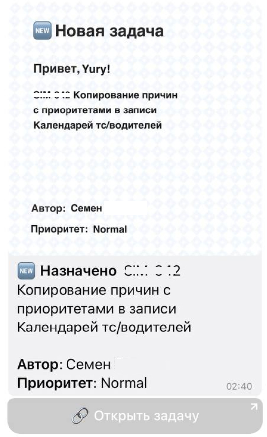

# Jira Notifier

> If you, like me, have cluttered mail from various notifications. This simple solution will allow you to receive notifications about new tasks assigned to you directly in your Telegram.

## Tech
 - Golang
 - Gin Gonic
 - Gorm

## Links

 - [Project Wiki](https://github.com/Mubiridziri/jira_notifier/wiki)
 - [Environment Settings](https://github.com/Mubiridziri/jira_notifier/wiki/Environment-Settings)
 - [Parameters](https://github.com/Mubiridziri/jira_notifier/wiki/Parameters)
 - [Telegram Admin Commands](https://github.com/Mubiridziri/jira_notifier/wiki/Telegram-Commands)

## Screenshots

## P.S

> Don't judge strictly, this is my first project in Golang after PHP/Symfony